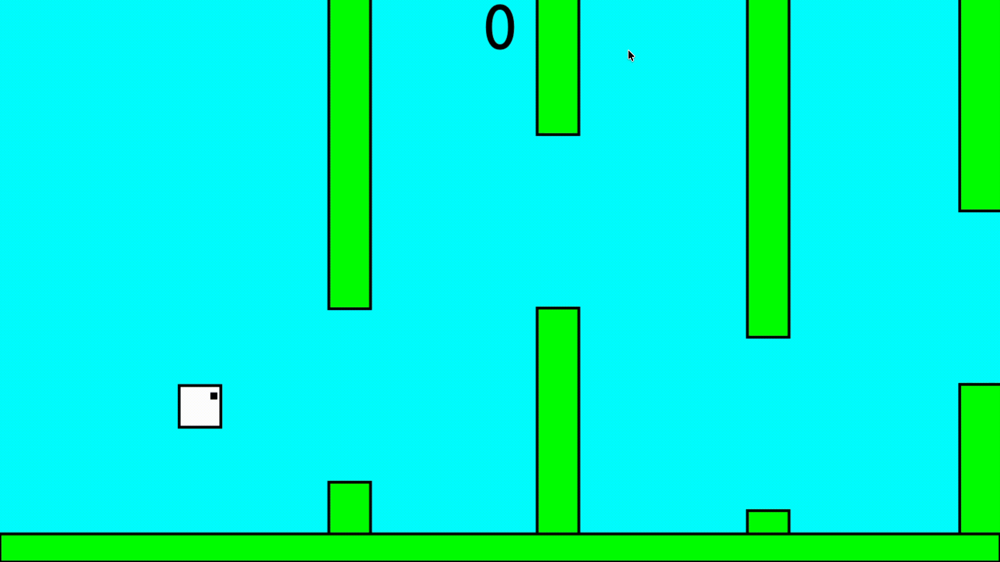

# TINY FLAPPY BIRD
This is a simple flappy bird game made in html and js. It is contained entirely in a single url. 

## HOW TO RUN
1. open [url.txt](url.txt)
2. copy the url
3. paste it into the address bar of your browser and click enter
4. enjoy!

## HOW TO PLAY
- click/space = flap
- avoid the pipes
- get as many points as possible
- click/space = reset after death

## FEATURES
- entire game contained in one URL
- no external libraries/assets
- runs directly in the browser
- simple physics and collision detection
- score tracking
- fits within 3KB

## SIZE
2.55/3KB